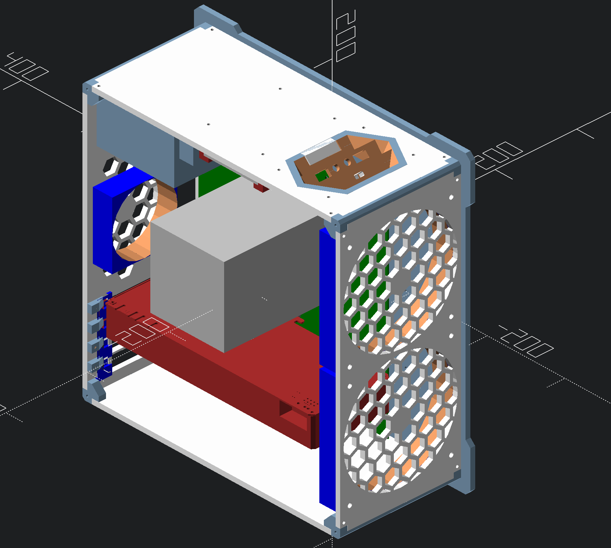

# mATX Case

This repository contains parts for constructing a small (~15L) mATX compatible computer case. It contains both parts which need to be printed, and parts which need to be laser cut.

## Motivation

Ever since I was able to hold a drill, I wanted to make my own computer case. Now, 20 years later, thanks to innovation in 3D printing and laser cutting, it has become trivial to build your own computer case.

In addition, I travel quite a bit and I wanted a computer that was small. Most computer cases are big because of the flexibility it affords. However, being able to print your own case, you can design it specifically for the parts you have in mind. That allows many areas for optimising space.

## Parts Required

- 12mm (6mm thread) brass stand-offs for motherboard.
- ... more stuff ...

### Inventory

- M3 x 12mm (6mm inset) brass standoffs.
- M3 x 6mm (6mm inset) brass standoffs.

- M3 x 12mm flat head screws.
- M3 x 8mm flat head screws.
- M4 x 14mm flat head screws.

- M3 x 8mm (5mm OD) knurled inserts.
- M3 x 10mm (5mm OD) knurled inserts.
- M3 x 12mm (5mm OD) knurled inserts.
- M3 x 6mm (5mm OD) knurled inserts.
- M4 x 8mm (6mm OD) knurled inserts.
- M6 x 12mm (8mm OD) knurled inserts.
- M4 x 4mm (6mm OD) knurled inserts.
- M3 x 4mm (5mm OD) knurled inserts.

### Power Supply

The [Corsair SF600 Platinum][1] has flat SATA cables and fits well.

[1]: https://www.corsair.com/us/en/Categories/Products/Power-Supply-Units/Power-Supply-Units-Advanced/SF-Series/p/CP-9020182-NA

## Instructions

Laser cut and print the parts. You will need to melt the brass knurled inserts into the relevant holes.

## Contributing

1. Fork it
2. Create your feature branch (`git checkout -b my-new-feature`)
3. Commit your changes (`git commit -am 'Add some feature'`)
4. Push to the branch (`git push origin my-new-feature`)
5. Create new Pull Request

## License

Released under the MIT license.

Copyright, 2018, by [Samuel G. D. Williams](http://www.codeotaku.com/samuel-williams).

Permission is hereby granted, free of charge, to any person obtaining a copy
of this software and associated documentation files (the "Software"), to deal
in the Software without restriction, including without limitation the rights
to use, copy, modify, merge, publish, distribute, sublicense, and/or sell
copies of the Software, and to permit persons to whom the Software is
furnished to do so, subject to the following conditions:

The above copyright notice and this permission notice shall be included in
all copies or substantial portions of the Software.

THE SOFTWARE IS PROVIDED "AS IS", WITHOUT WARRANTY OF ANY KIND, EXPRESS OR
IMPLIED, INCLUDING BUT NOT LIMITED TO THE WARRANTIES OF MERCHANTABILITY,
FITNESS FOR A PARTICULAR PURPOSE AND NONINFRINGEMENT. IN NO EVENT SHALL THE
AUTHORS OR COPYRIGHT HOLDERS BE LIABLE FOR ANY CLAIM, DAMAGES OR OTHER
LIABILITY, WHETHER IN AN ACTION OF CONTRACT, TORT OR OTHERWISE, ARISING FROM,
OUT OF OR IN CONNECTION WITH THE SOFTWARE OR THE USE OR OTHER DEALINGS IN
THE SOFTWARE.
